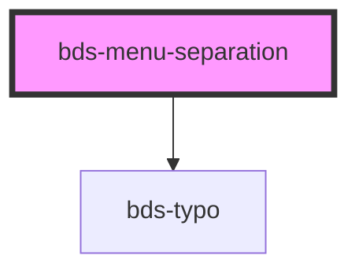

# bds-menu-divider

<!-- Auto Generated Below -->

## Properties

| Property | Attribute | Description | Type     | Default |
| -------- | --------- | ----------- | -------- | ------- |
| `size`   | `size`    | description | `string` | `null`  |
| `value`  | `value`   | description | `string` | `null`  |

## Dependencies

### Depends on

- [bds-typo](../../typo)

### Graph

----------------------------------------------

*Built with [StencilJS](https://stenciljs.com/)*
