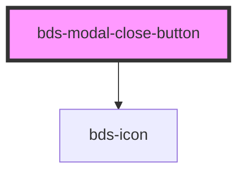

# bds-modal-close-button

<!-- Auto Generated Below -->

## Properties

| Property | Attribute | Description                           | Type      | Default |
| -------- | --------- | ------------------------------------- | --------- | ------- |
| `active` | `active`  | Used to hide or show the close button | `boolean` | `true`  |

## Dependencies

### Depends on

- [bds-icon](../../icon)

### Graph

----------------------------------------------

*Built with [StencilJS](https://stenciljs.com/)*
