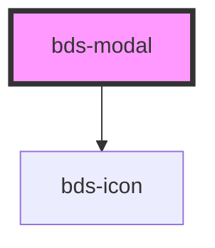

# bds-modal

<!-- Auto Generated Below -->

## Properties

| Property        | Attribute         | Description                                                                                                             | Type                   | Default   |
| --------------- | ----------------- | ----------------------------------------------------------------------------------------------------------------------- | ---------------------- | --------- |
| `closeButton`   | `close-button`    | Used to hide or show the close button                                                                                   | `boolean`              | `true`    |
| `dtButtonClose` | `dt-button-close` | Data test is the prop to specifically test the component action object. dtButtonClose is the data-test to button close. | `string`               | `null`    |
| `dtOutzone`     | `dt-outzone`      | Data test is the prop to specifically test the component action object. dtOutzone is the data-test to button close.     | `string`               | `null`    |
| `open`          | `open`            | Used to open/close the modal                                                                                            | `boolean`              | `false`   |
| `outzoneClose`  | `outzone-close`   | If true, the modal will close clicking outside the component.                                                           | `boolean`              | `true`    |
| `size`          | `size`            | Used to change the modal heights.                                                                                       | `"dynamic" \| "fixed"` | `'fixed'` |

## Events

| Event             | Description                            | Type               |
| ----------------- | -------------------------------------- | ------------------ |
| `bdsModalChanged` | Emitted when modal status has changed. | `CustomEvent<any>` |

## Methods

### `toggle() => Promise<void>`

Can be used outside to open/close the modal

#### Returns

Type: `Promise<void>`

## Dependencies

### Depends on

- [bds-icon](../icon)

### Graph

----------------------------------------------

*Built with [StencilJS](https://stenciljs.com/)*
