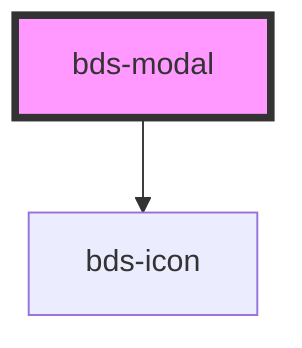

# bds-modal

<!-- Auto Generated Below -->

## Properties

| Property      | Attribute      | Description                           | Type      | Default |
| ------------- | -------------- | ------------------------------------- | --------- | ------- |
| `closeButton` | `close-button` | Used to hide or show the close button | `boolean` | `true`  |
| `open`        | `open`         | Used to open/close the modal          | `boolean` | `false` |

## Events

| Event             | Description                            | Type               |
| ----------------- | -------------------------------------- | ------------------ |
| `bdsModalChanged` | Emitted when modal status has changed. | `CustomEvent<any>` |

## Methods

### `toggle() => Promise<void>`

Can be used outside to open/close the modal

#### Returns

Type: `Promise<void>`

## Dependencies

### Depends on

- [bds-icon](../icon)

### Graph

----------------------------------------------

*Built with [StencilJS](https://stenciljs.com/)*
