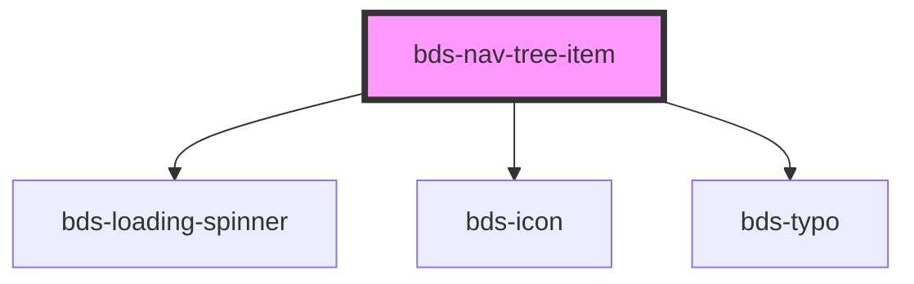

# bds-nav-tree-item

<!-- Auto Generated Below -->

## Properties

| Property            | Attribute        | Description                                                             | Type                     | Default     |
| ------------------- | ---------------- | ----------------------------------------------------------------------- | ------------------------ | ----------- |
| `collapse`          | `collapse`       | Focus Selected. Used to add title in header accordion.                  | `"multiple" \| "single"` | `'single'`  |
| `dataTest`          | `data-test`      | Data test is the prop to specifically test the component action object. | `string`                 | `null`      |
| `disable`           | `disable`        | Disable state. Indicates if the component is disabled.                  | `boolean`                | `false`     |
| `icon`              | `icon`           | Icon. Used to add icon in list item.                                    | `string`                 | `null`      |
| `isOpen`            | `is-open`        | Active. Used to define when the item is highlighted.                    | `boolean`                | `false`     |
| `loading`           | `loading`        | Loading state. Indicates if the component is in a loading state.        | `boolean`                | `false`     |
| `secondaryText`     | `secondary-text` | SecondaryText. Used to insert a secondaryText in the display item.      | `string`                 | `null`      |
| `text` _(required)_ | `text`           | Text. Used to insert a text in the display item.                        | `string`                 | `undefined` |

## Events

| Event             | Description                                                     | Type               |
| ----------------- | --------------------------------------------------------------- | ------------------ |
| `bdsToogleChange` | When de activation of component change, the event are dispache. | `CustomEvent<any>` |

## Methods

### `toggle() => Promise<void>`

#### Returns

Type: `Promise<void>`

## Dependencies

### Depends on

- [bds-loading-spinner](../loading-spinner)
- [bds-icon](../icon)
- [bds-typo](../typo)

### Graph

----------------------------------------------

*Built with [StencilJS](https://stenciljs.com/)*
