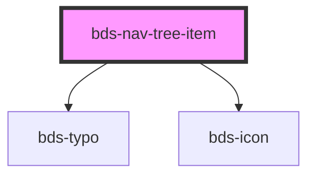

# bds-nav-tree-item

<!-- Auto Generated Below -->

## Properties

| Property        | Attribute        | Description                                                        | Type      | Default |
| --------------- | ---------------- | ------------------------------------------------------------------ | --------- | ------- |
| `active`        | `active`         | Active. Used to define when the item is highlighted.               | `boolean` | `false` |
| `secondaryText` | `secondary-text` | SecondaryText. Used to insert a secondaryText in the display item. | `string`  | `null`  |
| `text`          | `text`           | Text. Used to insert a text in the display item.                   | `string`  | `null`  |

## Events

| Event             | Description                                                     | Type               |
| ----------------- | --------------------------------------------------------------- | ------------------ |
| `bdsActiveChange` | When de activation of component change, the event are dispache. | `CustomEvent<any>` |

## Methods

### `toggle() => Promise<void>`

#### Returns

Type: `Promise<void>`

## Dependencies

### Depends on

- [bds-typo](../typo)
- [bds-icon](../icon)

### Graph

----------------------------------------------

*Built with [StencilJS](https://stenciljs.com/)*
