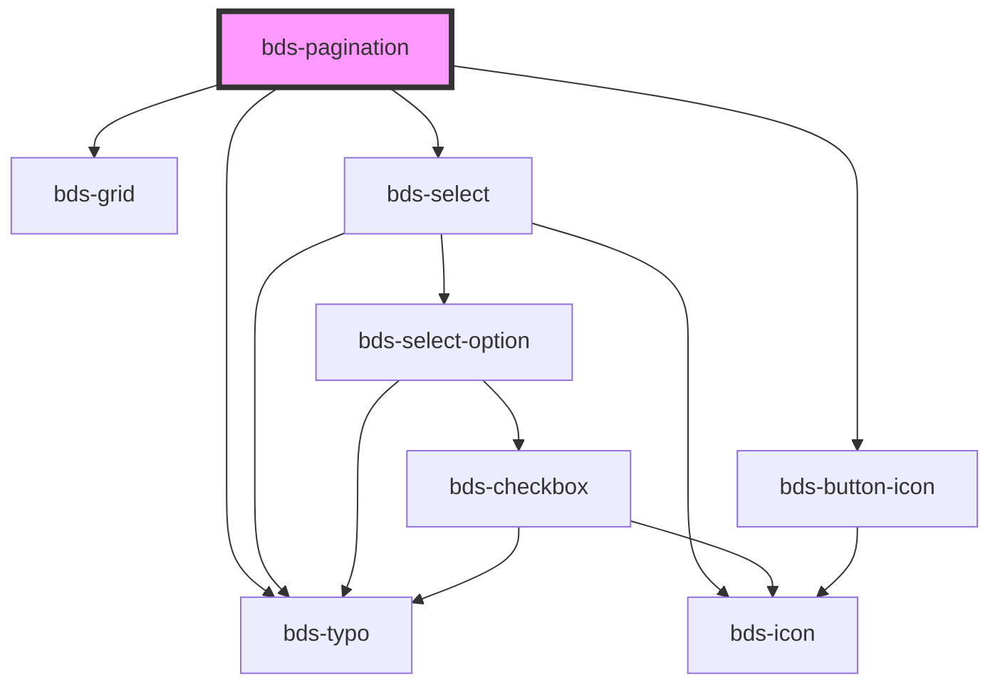

# bds-pagination

<!-- Auto Generated Below -->

## Properties

| Property          | Attribute           | Description                                                                                                                                        | Type                          | Default     |
| ----------------- | ------------------- | -------------------------------------------------------------------------------------------------------------------------------------------------- | ----------------------------- | ----------- |
| `dtButtonEnd`     | `dt-button-end`     | Propriedade de teste para especificamente testar a ação do botão final. dtButtonEnd é o data-test para o botão final.                              | `string`                      | `null`      |
| `dtButtonInitial` | `dt-button-initial` | Propriedade de teste para especificamente testar a ação do botão inicial. dtButtonInitial é o data-test para o botão inicial.                      | `string`                      | `null`      |
| `dtButtonNext`    | `dt-button-next`    | Propriedade de teste para especificamente testar a ação do botão de próxima página. dtButtonNext é o data-test para o botão próximo.               | `string`                      | `null`      |
| `dtButtonPrev`    | `dt-button-prev`    | Propriedade de teste para especificamente testar a ação do botão de página anterior. dtButtonPrev é o data-test para o botão anterior.             | `string`                      | `null`      |
| `dtSelectNumber`  | `dt-select-number`  | Propriedade de teste para especificamente testar o seletor de número de páginas. dtSelectNumber é o data-test para o seletor de número de páginas. | `string`                      | `null`      |
| `itemsPage`       | `items-page`        |                                                                                                                                                    | `any`                         | `undefined` |
| `language`        | `language`          |                                                                                                                                                    | `string`                      | `'pt_BR'`   |
| `numberItems`     | `number-items`      |                                                                                                                                                    | `number`                      | `undefined` |
| `optionsPosition` | `options-position`  | Define a posição do menu de opções. Pode ser 'bottom' ou 'top'. Padrão é 'auto', que ajusta automaticamente a posição.                             | `"auto" \| "bottom" \| "top"` | `'auto'`    |
| `pageCounter`     | `page-counter`      |                                                                                                                                                    | `boolean`                     | `false`     |
| `pages`           | `pages`             | Propriedade para receber o número total de páginas, baseado no total de itens e itens por página.                                                  | `number`                      | `undefined` |
| `startedPage`     | `started-page`      | Propriedade que define a página inicial ao renderizar o componente.                                                                                | `number`                      | `undefined` |

## Events

| Event                   | Description                                                                                                                     | Type               |
| ----------------------- | ------------------------------------------------------------------------------------------------------------------------------- | ------------------ |
| `bdsItemsPerPageChange` | Evento emitido quando o valor da página atual é alterado. Pode ser escutado para realizar ações específicas ao mudar de página. | `CustomEvent<any>` |
| `bdsPaginationChange`   | Evento emitido quando o valor da página atual é alterado. Pode ser escutado para realizar ações específicas ao mudar de página. | `CustomEvent<any>` |

## Dependencies

### Depends on

- [bds-grid](../grid)
- [bds-typo](../typo)
- [bds-select](../selects/select)
- [bds-button-icon](../icon-button)

### Graph

----------------------------------------------

*Built with [StencilJS](https://stenciljs.com/)*
