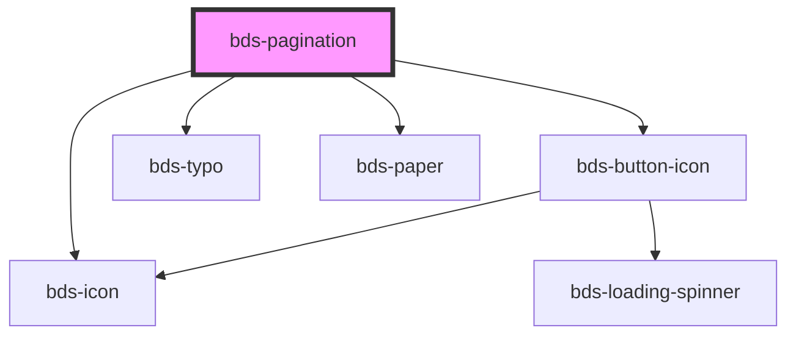

# bds-pagination

<!-- Auto Generated Below -->

## Properties

| Property      | Attribute      | Description                                      | Type     | Default     |
| ------------- | -------------- | ------------------------------------------------ | -------- | ----------- |
| `pages`       | `pages`        | Prop to recive the number of pages.              | `number` | `undefined` |
| `startedPage` | `started-page` | When the component are render this page are set. | `number` | `undefined` |

## Events

| Event                 | Description                                                | Type               |
| --------------------- | ---------------------------------------------------------- | ------------------ |
| `bdsPaginationChange` | When de value of component change, the event are dispache. | `CustomEvent<any>` |

## Dependencies

### Depends on

- [bds-button-icon](../icon-button)
- [bds-typo](../typo)
- [bds-icon](../icon)
- [bds-paper](../paper)

### Graph

----------------------------------------------

*Built with [StencilJS](https://stenciljs.com/)*
