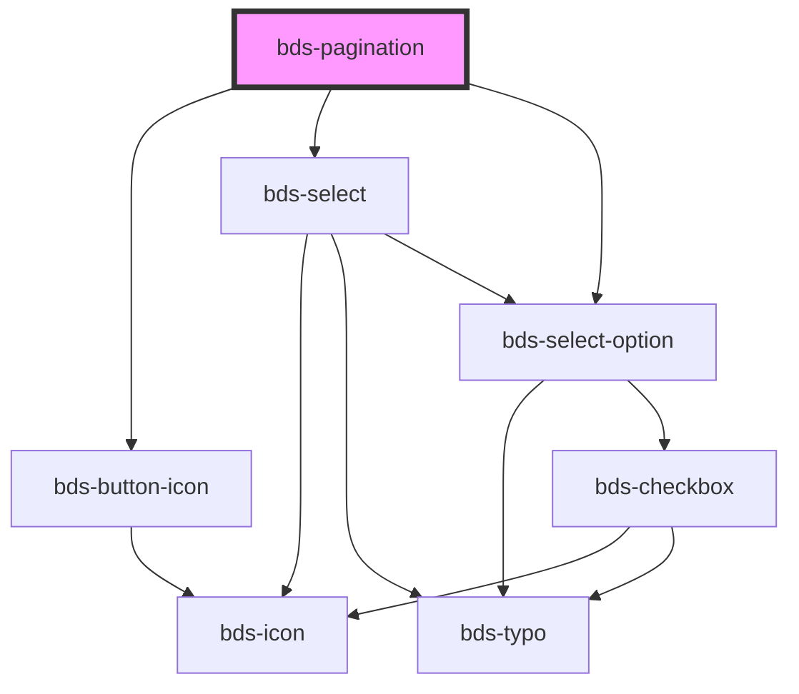

# bds-pagination

<!-- Auto Generated Below -->

## Properties

| Property          | Attribute           | Description                                                                                                                 | Type                          | Default     |
| ----------------- | ------------------- | --------------------------------------------------------------------------------------------------------------------------- | ----------------------------- | ----------- |
| `dtButtonEnd`     | `dt-button-end`     | Data test is the prop to specifically test the component action object. dtButtonEnd is the data-test to button end          | `string`                      | `null`      |
| `dtButtonInitial` | `dt-button-initial` | Data test is the prop to specifically test the component action object. dtButtonInitial is the data-test to button initial. | `string`                      | `null`      |
| `dtButtonNext`    | `dt-button-next`    | Data test is the prop to specifically test the component action object. dtButtonNext is the data-test to button next.       | `string`                      | `null`      |
| `dtButtonPrev`    | `dt-button-prev`    | Data test is the prop to specifically test the component action object. dtButtonPrev is the data-test to button prev.       | `string`                      | `null`      |
| `dtSelectNumber`  | `dt-select-number`  | Data test is the prop to specifically test the component action object. dtSelectNumber is the data-test to select number.   | `string`                      | `null`      |
| `optionsPosition` | `options-position`  | Set the placement of the options menu. Can be 'bottom' or 'top'.                                                            | `"auto" \| "bottom" \| "top"` | `'auto'`    |
| `pages`           | `pages`             | Prop to recive the number of pages.                                                                                         | `number`                      | `undefined` |
| `startedPage`     | `started-page`      | When the component are render this page are set.                                                                            | `number`                      | `undefined` |

## Events

| Event                 | Description                                                | Type               |
| --------------------- | ---------------------------------------------------------- | ------------------ |
| `bdsPaginationChange` | When de value of component change, the event are dispache. | `CustomEvent<any>` |

## Dependencies

### Depends on

- [bds-button-icon](../icon-button)
- [bds-select](../selects/select)
- [bds-select-option](../select-option)

### Graph

----------------------------------------------

*Built with [StencilJS](https://stenciljs.com/)*
