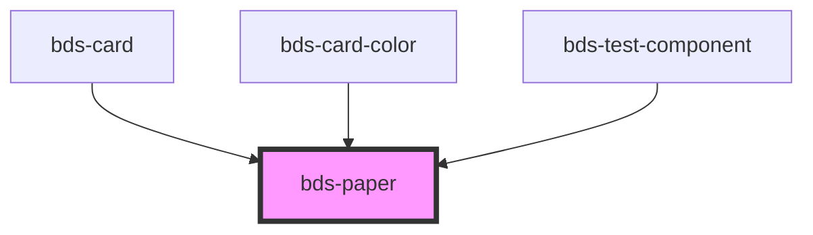

# bds-paper

<!-- Auto Generated Below -->

## Properties

| Property      | Attribute      | Description                                                                        | Type                                                                                                                                | Default       |
| ------------- | -------------- | ---------------------------------------------------------------------------------- | ----------------------------------------------------------------------------------------------------------------------------------- | ------------- |
| `bgColor`     | `bg-color`     | Prop for set the background color.                                                 | `"surface-0" \| "surface-1" \| "surface-2" \| "surface-3" \| "surface-4"`                                                           | `'surface-1'` |
| `border`      | `border`       | Prop for set the border of the component.                                          | `boolean`                                                                                                                           | `false`       |
| `borderColor` | `border-color` | Prop for set the border color.                                                     | `"border-1" \| "border-2" \| "delete" \| "error" \| "negative" \| "positive" \| "primary" \| "secondary" \| "success" \| "warning"` | `null`        |
| `dataTest`    | `data-test`    | Data test is the prop to specifically test the component action object.            | `string`                                                                                                                            | `null`        |
| `elevation`   | `elevation`    | Size. Entered as one of the size. Can be one of: 'static', 'primary', 'secondary'; | `"none" \| "primary" \| "secondary" \| "static"`                                                                                    | `'static'`    |
| `height`      | `height`       | Prop for set the height of the component.                                          | `string`                                                                                                                            | `null`        |
| `width`       | `width`        | Prop for set the width of the component.                                           | `string`                                                                                                                            | `null`        |

## Dependencies

### Used by

 - [bds-card](../card)
 - [bds-card-color](../card-color)
 - [bds-test-component](../test-component)

### Graph

----------------------------------------------

*Built with [StencilJS](https://stenciljs.com/)*
