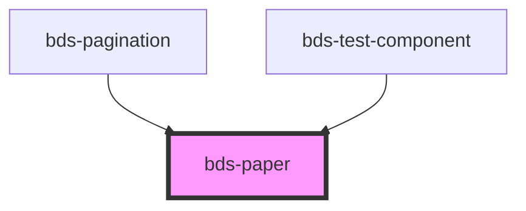

# bds-paper

<!-- Auto Generated Below -->

## Properties

| Property    | Attribute   | Description                                                                        | Type                                   | Default    |
| ----------- | ----------- | ---------------------------------------------------------------------------------- | -------------------------------------- | ---------- |
| `dataTest`  | `data-test` | Data test is the prop to specifically test the component action object.            | `string`                               | `null`     |
| `elevation` | `elevation` | Size. Entered as one of the size. Can be one of: 'static', 'primary', 'secondary'; | `"primary" \| "secondary" \| "static"` | `'static'` |
| `height`    | `height`    | Prop for set the height of the component.                                          | `string`                               | `null`     |
| `width`     | `width`     | Prop for set the width of the component.                                           | `string`                               | `null`     |

## Dependencies

### Used by

 - [bds-pagination](../pagination)
 - [bds-test-component](../test-component)

### Graph

----------------------------------------------

*Built with [StencilJS](https://stenciljs.com/)*
