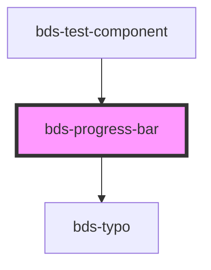

# bds-progress-bar

<!-- Auto Generated Below -->

## Properties

| Property  | Attribute | Description                                                          | Type                                                    | Default     |
| --------- | --------- | -------------------------------------------------------------------- | ------------------------------------------------------- | ----------- |
| `color`   | `color`   | Text, property to define status of component.                        | `"default" \| "information" \| "positive" \| "warning"` | `'default'` |
| `percent` | `percent` | Percent, property to enter the progress bar status percentage value. | `number`                                                | `0`         |
| `size`    | `size`    | Size, property to define size of component.                          | `"default" \| "small"`                                  | `'default'` |
| `text`    | `text`    | Text, property to enable the bar info text.                          | `string`                                                | `''`        |

## Dependencies

### Used by

 - [bds-test-component](../test-component)

### Depends on

- [bds-typo](../typo)

### Graph

----------------------------------------------

*Built with [StencilJS](https://stenciljs.com/)*
