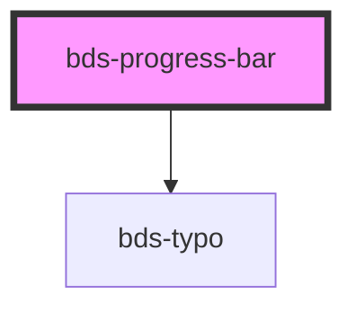

# bds-progress-bar

<!-- Auto Generated Below -->

## Properties

| Property  | Attribute | Description           | Type      | Default |
| --------- | --------- | --------------------- | --------- | ------- |
| `percent` | `percent` | Percent, description. | `number`  | `0`     |
| `text`    | `text`    | Text, description.    | `boolean` | `false` |

## Dependencies

### Depends on

- [bds-typo](../typo)

### Graph

----------------------------------------------

*Built with [StencilJS](https://stenciljs.com/)*
