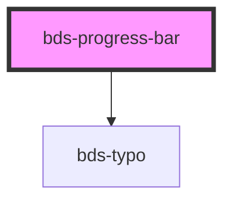

# bds-progress-bar

<!-- Auto Generated Below -->

## Properties

| Property  | Attribute | Description                                                          | Type     | Default |
| --------- | --------- | -------------------------------------------------------------------- | -------- | ------- |
| `percent` | `percent` | Percent, property to enter the progress bar status percentage value. | `number` | `0`     |
| `text`    | `text`    | Text, property to enable the bar info text.                          | `string` | `''`    |

## Dependencies

### Depends on

- [bds-typo](../typo)

### Graph

----------------------------------------------

*Built with [StencilJS](https://stenciljs.com/)*
