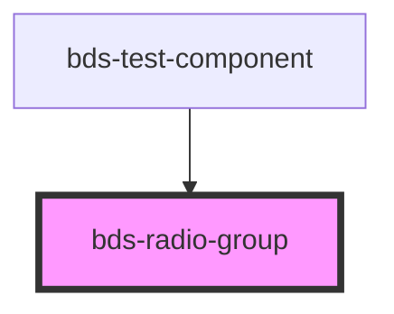

# bds-radio-group

<!-- Auto Generated Below -->

## Properties

| Property | Attribute | Description                     | Type     | Default     |
| -------- | --------- | ------------------------------- | -------- | ----------- |
| `value`  | `value`   | The value of the selected radio | `string` | `undefined` |

## Events

| Event                 | Description                                              | Type               |
| --------------------- | -------------------------------------------------------- | ------------------ |
| `bdsRadioGroupChange` | Emitted when the value has changed due to a click event. | `CustomEvent<any>` |

## Dependencies

### Used by

 - [bds-test-component](../test-component)

### Graph

----------------------------------------------

*Built with [StencilJS](https://stenciljs.com/)*
