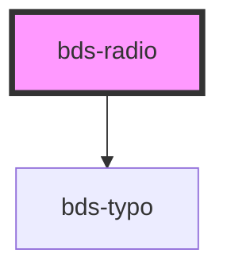

# bds-radio

<!-- Auto Generated Below -->

## Properties

| Property             | Attribute  | Description                                                     | Type      | Default     |
| -------------------- | ---------- | --------------------------------------------------------------- | --------- | ----------- |
| `checked`            | `checked`  | If `true`, the checkbox is selected.                            | `boolean` | `false`     |
| `disabled`           | `disabled` | If `true`, the user cannot interact with the checkbox.          | `boolean` | `false`     |
| `label` _(required)_ | `label`    |                                                                 | `string`  | `undefined` |
| `name` _(required)_  | `name`     | The name of the control, which is submitted with the form data. | `string`  | `undefined` |
| `refer` _(required)_ | `refer`    |                                                                 | `string`  | `undefined` |
| `value` _(required)_ | `value`    |                                                                 | `string`  | `undefined` |

## Events

| Event       | Description                         | Type               |
| ----------- | ----------------------------------- | ------------------ |
| `bdsChange` | Emitted when the value has changed. | `CustomEvent<any>` |

## Methods

### `getInputElement() => Promise<HTMLInputElement>`

#### Returns

Type: `Promise<HTMLInputElement>`

### `getValue() => Promise<boolean>`

#### Returns

Type: `Promise<boolean>`

## Dependencies

### Depends on

- [bds-typo](../typo)

### Graph

----------------------------------------------

*Built with [StencilJS](https://stenciljs.com/)*
