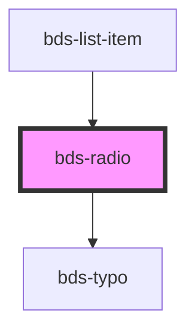

# bds-radio

<!-- Auto Generated Below -->

## Properties

| Property             | Attribute   | Description                                                             | Type      | Default     |
| -------------------- | ----------- | ----------------------------------------------------------------------- | --------- | ----------- |
| `checked`            | `checked`   | If `true`, the checkbox is selected.                                    | `boolean` | `false`     |
| `dataTest`           | `data-test` | Data test is the prop to specifically test the component action object. | `string`  | `null`      |
| `disabled`           | `disabled`  | If `true`, the user cannot interact with the checkbox.                  | `boolean` | `false`     |
| `label`              | `label`     | label in radio, with he the input size increases.                       | `string`  | `undefined` |
| `name`               | `name`      | The name of the control, which is submitted with the form data.         | `string`  | `undefined` |
| `refer`              | `refer`     | Refer. Field to add refer in radio buttom.                              | `string`  | `undefined` |
| `value` _(required)_ | `value`     | The value of the input.                                                 | `string`  | `undefined` |

## Events

| Event            | Description                                                  | Type               |
| ---------------- | ------------------------------------------------------------ | ------------------ |
| `bdsChange`      | Emitted when the value has changed.                          | `CustomEvent<any>` |
| `bdsClickChange` | Emitted when the value has changed because of a click event. | `CustomEvent<any>` |

## Methods

### `getInputElement() => Promise<HTMLInputElement>`

#### Returns

Type: `Promise<HTMLInputElement>`

### `getValue() => Promise<boolean>`

#### Returns

Type: `Promise<boolean>`

## Dependencies

### Used by

 - [bds-list-item](../list)

### Depends on

- [bds-typo](../typo)

### Graph

----------------------------------------------

*Built with [StencilJS](https://stenciljs.com/)*
