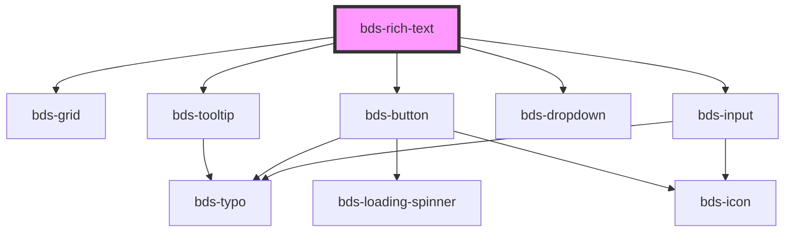

# bds-rich-text

<!-- Auto Generated Below -->

## Properties

| Property          | Attribute           | Description                                                             | Type                            | Default   |
| ----------------- | ------------------- | ----------------------------------------------------------------------- | ------------------------------- | --------- |
| `buttonBold`      | `button-bold`       | buttonBold to define if component has Bold Control.                     | `boolean`                       | `true`    |
| `buttonCode`      | `button-code`       | buttonCode to define if component has Code Control.                     | `boolean`                       | `true`    |
| `buttonHeading`   | `button-heading`    | buttonHeading to define if component has Heading Control.               | `boolean`                       | `true`    |
| `buttonItalic`    | `button-italic`     | buttonItalic to define if component has Italic Control.                 | `boolean`                       | `true`    |
| `buttonLink`      | `button-link`       | buttonLink to define if component has Link Control.                     | `boolean`                       | `true`    |
| `buttonList`      | `button-list`       | buttonList to define if component has List Control.                     | `boolean`                       | `true`    |
| `buttonQuote`     | `button-quote`      | buttonQuote to define if component has Quote Control.                   | `boolean`                       | `true`    |
| `buttonStrike`    | `button-strike`     | buttonStrike to define if component has Strike Control.                 | `boolean`                       | `true`    |
| `buttonTextAlign` | `button-text-align` | buttonTextAlign to define if component has TextAlign Control.           | `boolean`                       | `true`    |
| `buttonUnderline` | `button-underline`  | buttonUnderline to define if component has Underline Control.           | `boolean`                       | `true`    |
| `buttonUnstyled`  | `button-unstyled`   | buttonUnstyled to define if component has Unstyled Control.             | `boolean`                       | `true`    |
| `dataTest`        | `data-test`         | Data test is the prop to specifically test the component action object. | `string`                        | `null`    |
| `height`          | `height`            | height is the prop to define height of component.                       | `string`                        | `null`    |
| `language`        | `language`          | Set the language for fixed texts.                                       | `"en_US" \| "es_ES" \| "pt_BR"` | `'pt_BR'` |
| `maxHeight`       | `max-height`        | maxHeight is the prop to define max height of component.                | `string`                        | `null`    |
| `positionBar`     | `position-bar`      | positionBar is the prop to define max height of component.              | `"bottom" \| "top"`             | `'top'`   |

## Events

| Event               | Description                         | Type                         |
| ------------------- | ----------------------------------- | ---------------------------- |
| `bdsBlur`           | Event input onblur.                 | `CustomEvent<any>`           |
| `bdsFocus`          | Event input focus.                  | `CustomEvent<any>`           |
| `bdsRichTextChange` | Emitted when the value has changed. | `CustomEvent<any>`           |
| `bdsRichTextInput`  | Emitted when the input has changed. | `CustomEvent<KeyboardEvent>` |

## Dependencies

### Depends on

- [bds-grid](../grid)
- [bds-tooltip](../tooltip)
- [bds-button](../button)
- [bds-dropdown](../dropdown)
- [bds-input](../input)

### Graph

----------------------------------------------

*Built with [StencilJS](https://stenciljs.com/)*
