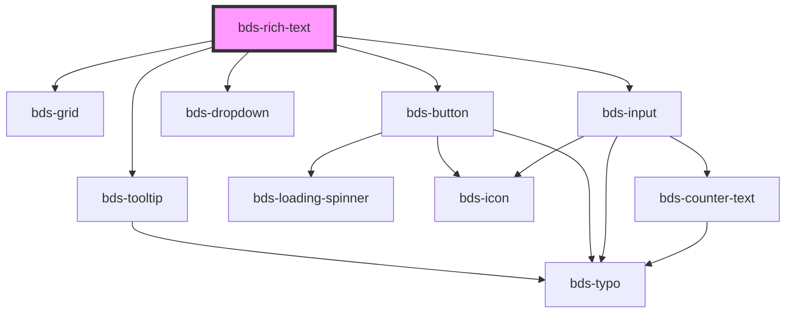

# bds-rich-text

<!-- Auto Generated Below -->

## Properties

| Property   | Attribute   | Description                                                             | Type                            | Default   |
| ---------- | ----------- | ----------------------------------------------------------------------- | ------------------------------- | --------- |
| `dataTest` | `data-test` | Data test is the prop to specifically test the component action object. | `string`                        | `null`    |
| `height`   | `height`    | Data test is the prop to specifically test the component action object. | `string`                        | `null`    |
| `language` | `language`  | Set the language for fixed texts.                                       | `"en_US" \| "es_ES" \| "pt_BR"` | `'pt_BR'` |

## Events

| Event               | Description                         | Type                         |
| ------------------- | ----------------------------------- | ---------------------------- |
| `bdsBlur`           | Event input onblur.                 | `CustomEvent<any>`           |
| `bdsFocus`          | Event input focus.                  | `CustomEvent<any>`           |
| `bdsRichTextChange` | Emitted when the value has changed. | `CustomEvent<any>`           |
| `bdsRichTextInput`  | Emitted when the input has changed. | `CustomEvent<KeyboardEvent>` |

## Dependencies

### Depends on

- [bds-grid](../grid)
- [bds-tooltip](../tooltip)
- [bds-button](../button)
- [bds-dropdown](../dropdown)
- [bds-input](../input)

### Graph

----------------------------------------------

*Built with [StencilJS](https://stenciljs.com/)*
