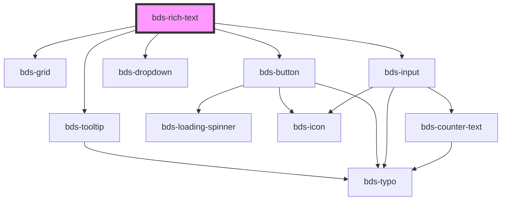

# bds-rich-text

<!-- Auto Generated Below -->

## Properties

| Property              | Attribute               | Description                                                             | Type                            | Default   |
| --------------------- | ----------------------- | ----------------------------------------------------------------------- | ------------------------------- | --------- |
| `alignmentButtons`    | `alignment-buttons`     | alignmentButtons to define if component has TextAlign Control.          | `boolean`                       | `true`    |
| `codeButton`          | `code-button`           | codeButton to define if component has Code Control.                     | `boolean`                       | `true`    |
| `dataTest`            | `data-test`             | Data test is the prop to specifically test the component action object. | `string`                        | `null`    |
| `headingButtons`      | `heading-buttons`       | headingButtons to define if component has Heading Control.              | `boolean`                       | `true`    |
| `height`              | `height`                | height is the prop to define height of component.                       | `string`                        | `null`    |
| `italicButton`        | `italic-button`         | italicButton to define if component has Italic Control.                 | `boolean`                       | `true`    |
| `language`            | `language`              | Set the language for fixed texts.                                       | `"en_US" \| "es_ES" \| "pt_BR"` | `'pt_BR'` |
| `linkButton`          | `link-button`           | linkButton to define if component has Link Control.                     | `boolean`                       | `true`    |
| `listButtons`         | `list-buttons`          | listButtons to define if component has List Control.                    | `boolean`                       | `true`    |
| `maxHeight`           | `max-height`            | maxHeight is the prop to define max height of component.                | `string`                        | `null`    |
| `positionBar`         | `position-bar`          | positionBar is the prop to define max height of component.              | `"bottom" \| "top"`             | `'top'`   |
| `quoteButton`         | `quote-button`          | quoteButton to define if component has Quote Control.                   | `boolean`                       | `true`    |
| `strikeThroughButton` | `strike-through-button` | strikeThroughbutton to define if component has Strike Control.          | `boolean`                       | `true`    |
| `underlineButton`     | `underline-button`      | underlineButton to define if component has Underline Control.           | `boolean`                       | `true`    |
| `unstyledButton`      | `unstyled-button`       | unstyledButton to define if component has Unstyled Control.             | `boolean`                       | `true`    |
| `weightButton`        | `weight-button`         | weightButton to define if component has Bold Control.                   | `boolean`                       | `true`    |

## Events

| Event               | Description                         | Type                         |
| ------------------- | ----------------------------------- | ---------------------------- |
| `bdsBlur`           | Event input onblur.                 | `CustomEvent<any>`           |
| `bdsFocus`          | Event input focus.                  | `CustomEvent<any>`           |
| `bdsRichTextChange` | Emitted when the value has changed. | `CustomEvent<any>`           |
| `bdsRichTextInput`  | Emitted when the input has changed. | `CustomEvent<KeyboardEvent>` |

## Dependencies

### Depends on

- [bds-grid](../grid)
- [bds-tooltip](../tooltip)
- [bds-button](../button)
- [bds-dropdown](../dropdown)
- [bds-input](../input)

### Graph

----------------------------------------------

*Built with [StencilJS](https://stenciljs.com/)*
