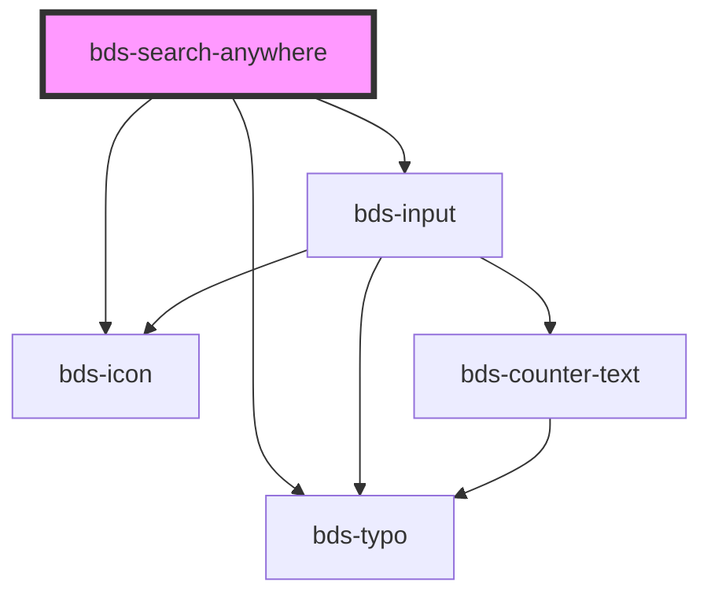

# bds-search-anywhere

<!-- Auto Generated Below -->

## Properties

| Property             | Attribute             | Description                                                                                                                 | Type                               | Default     |
| -------------------- | --------------------- | --------------------------------------------------------------------------------------------------------------------------- | ---------------------------------- | ----------- |
| `language`           | `language`            | Language for UI text translations (pt_BR, en_US, es_ES)                                                                     | `"en_US" \| "es_ES" \| "pt_BR"`    | `'pt_BR'`   |
| `maxResults`         | `max-results`         | Maximum number of results to display                                                                                        | `number`                           | `10`        |
| `options`            | `options`             | Options to be displayed in the search results. Can be passed as JSON string or array of SearchAnywhereOption objects.       | `SearchAnywhereOption[] \| string` | `[]`        |
| `placeholder`        | `placeholder`         | Placeholder text for the search input (when modal is open) If not provided, uses translated default based on language prop  | `string`                           | `undefined` |
| `showShortcut`       | `show-shortcut`       | If true, displays the keyboard shortcut hint on the trigger                                                                 | `boolean`                          | `true`      |
| `triggerPlaceholder` | `trigger-placeholder` | Placeholder text for the trigger input (before modal opens) If not provided, uses translated default based on language prop | `string`                           | `undefined` |

## Events

| Event             | Description                          | Type                                           |
| ----------------- | ------------------------------------ | ---------------------------------------------- |
| `bdsSearchChange` | Emitted when the search text changes | `CustomEvent<SearchAnywhereChangeEventDetail>` |
| `bdsSearchClose`  | Emitted when the modal closes        | `CustomEvent<any>`                             |
| `bdsSearchOpen`   | Emitted when the modal opens         | `CustomEvent<any>`                             |
| `bdsSearchSelect` | Emitted when an option is selected   | `CustomEvent<SearchAnywhereSelectEventDetail>` |

## Methods

### `close() => Promise<void>`

Closes the search modal programmatically

#### Returns

Type: `Promise<void>`

### `getIsOpen() => Promise<boolean>`

Gets the current open state (for testing)

#### Returns

Type: `Promise<boolean>`

### `getSearchText() => Promise<string>`

Gets the current search text (for testing)

#### Returns

Type: `Promise<string>`

### `getSelectedIndex() => Promise<number>`

Gets the current selected index (for testing)

#### Returns

Type: `Promise<number>`

### `open() => Promise<void>`

Opens the search modal programmatically

#### Returns

Type: `Promise<void>`

## Dependencies

### Depends on

- [bds-input](../input)
- [bds-typo](../typo)
- [bds-icon](../icon)

### Graph

----------------------------------------------

*Built with [StencilJS](https://stenciljs.com/)*
