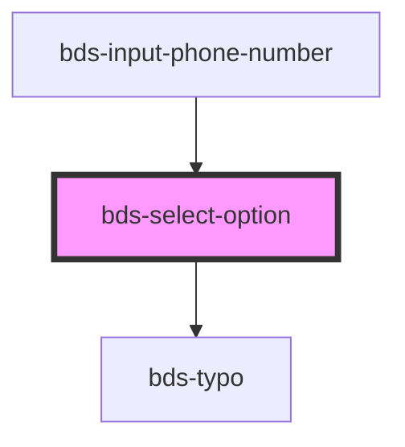

# bds-select

<!-- Auto Generated Below -->

## Properties

| Property             | Attribute     | Description                                                                      | Type      | Default     |
| -------------------- | ------------- | -------------------------------------------------------------------------------- | --------- | ----------- |
| `bulkOption`         | `bulk-option` | Quantity Description on option value, this item is locate to rigth in component. | `string`  | `''`        |
| `disabled`           | `disabled`    | If `true`, the user cannot interact with the select option.                      | `boolean` | `false`     |
| `selected`           | `selected`    | The text value of the option.                                                    | `boolean` | `false`     |
| `value` _(required)_ | `value`       |                                                                                  | `any`     | `undefined` |

## Events

| Event            | Description | Type               |
| ---------------- | ----------- | ------------------ |
| `optionSelected` |             | `CustomEvent<any>` |

## Dependencies

### Used by

 - [bds-input-phone-number](../input-phone-number)

### Depends on

- [bds-typo](../typo)

### Graph

----------------------------------------------

*Built with [StencilJS](https://stenciljs.com/)*
