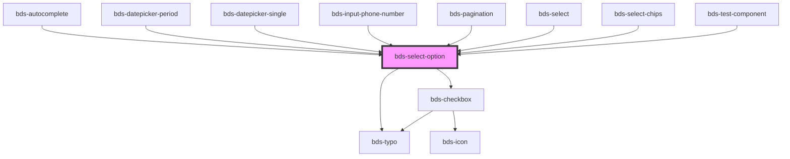

# bds-select

<!-- Auto Generated Below -->

## Properties

| Property             | Attribute     | Description                                                                                               | Type                      | Default     |
| -------------------- | ------------- | --------------------------------------------------------------------------------------------------------- | ------------------------- | ----------- |
| `bulkOption`         | `bulk-option` | Quantity Description on option value, this item is locate to rigth in component.                          | `string`                  | `''`        |
| `checked`            | `checked`     | If `true`, the checkbox is selected.                                                                      | `boolean`                 | `false`     |
| `danger`             | `danger`      | Add state danger on input, use for use feedback.                                                          | `boolean`                 | `false`     |
| `dataTest`           | `data-test`   | Data test is the prop to specifically test the component action object.                                   | `string`                  | `null`      |
| `disabled`           | `disabled`    | If `true`, the user cannot interact with the select option.                                               | `boolean`                 | `false`     |
| `invisible`          | `invisible`   | Add state danger on input, use for use feedback.                                                          | `boolean`                 | `false`     |
| `selected`           | `selected`    | The text value of the option.                                                                             | `boolean`                 | `false`     |
| `slotAlign`          | `slot-align`  | Alignment of input-left slot. The value need to be one of the values used on flexbox align-self property. | `string`                  | `'center'`  |
| `status`             | `status`      | If set, a text will be displayed on the right side of the option label                                    | `string`                  | `undefined` |
| `titleText`          | `title-text`  | If set, a title will be shown under the text                                                              | `string`                  | `undefined` |
| `typeOption`         | `type-option` | Type Option. Used toselect type of item list.                                                             | `"checkbox" \| "default"` | `'default'` |
| `value` _(required)_ | `value`       |                                                                                                           | `any`                     | `undefined` |

## Events

| Event            | Description | Type               |
| ---------------- | ----------- | ------------------ |
| `optionChecked`  |             | `CustomEvent<any>` |
| `optionSelected` |             | `CustomEvent<any>` |

## Methods

### `markOff() => Promise<void>`

#### Returns

Type: `Promise<void>`

### `toMark() => Promise<void>`

#### Returns

Type: `Promise<void>`

### `toggle() => Promise<void>`

#### Returns

Type: `Promise<void>`

## Dependencies

### Used by

 - [bds-autocomplete](../autocomplete)
 - [bds-datepicker-period](../datepicker/datepicker-period)
 - [bds-datepicker-single](../datepicker/datepicker-single)
 - [bds-input-phone-number](../input-phone-number)
 - [bds-pagination](../pagination)
 - [bds-select](../selects/select)
 - [bds-select-chips](../selects/select-chips)
 - [bds-test-component](../test-component)

### Depends on

- [bds-typo](../typo)
- [bds-checkbox](../checkbox)

### Graph

----------------------------------------------

*Built with [StencilJS](https://stenciljs.com/)*
