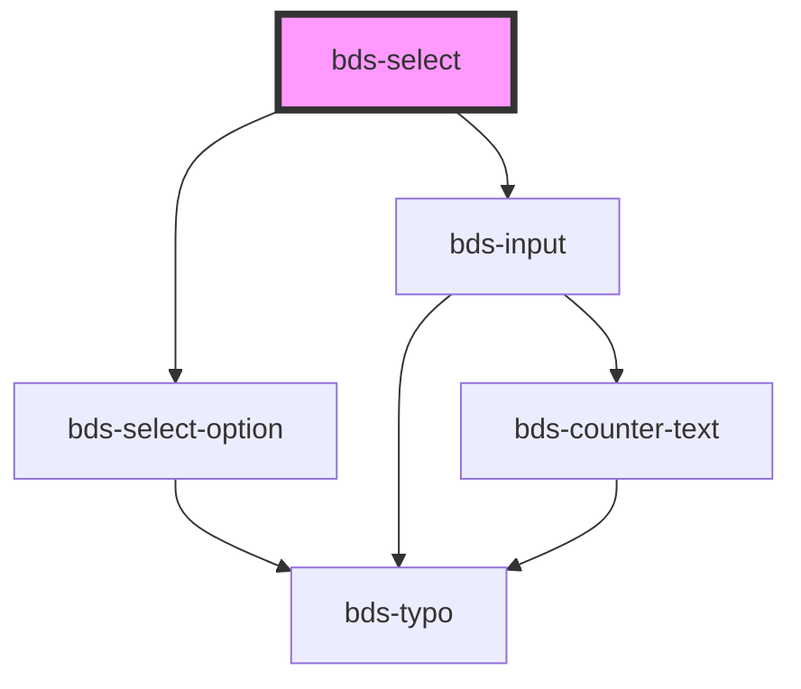

# bds-select

<!-- Auto Generated Below -->

## Properties

| Property   | Attribute  | Description                                       | Type       | Default     |
| ---------- | ---------- | ------------------------------------------------- | ---------- | ----------- |
| `danger`   | `danger`   | Add state danger on input, use for use feedback.  | `boolean`  | `false`     |
| `disabled` | `disabled` | Disabled input.                                   | `boolean`  | `false`     |
| `label`    | `label`    | label in input, with he the input size increases. | `string`   | `''`        |
| `options`  | --         |                                                   | `Option[]` | `[]`        |
| `value`    | `value`    | the value of the select.                          | `any`      | `undefined` |

## Events

| Event       | Description                              | Type                                   |
| ----------- | ---------------------------------------- | -------------------------------------- |
| `bdsBlur`   | Emitted when the select loses focus.     | `CustomEvent<void>`                    |
| `bdsCancel` | Emitted when the selection is cancelled. | `CustomEvent<void>`                    |
| `bdsChange` | Emitted when the value has changed.      | `CustomEvent<SelectChangeEventDetail>` |
| `bdsFocus`  | Emitted when the select loses focus.     | `CustomEvent<void>`                    |

## Dependencies

### Depends on

- [bds-select-option](../select-option)
- [bds-input](../input)

### Graph

----------------------------------------------

*Built with [StencilJS](https://stenciljs.com/)*
