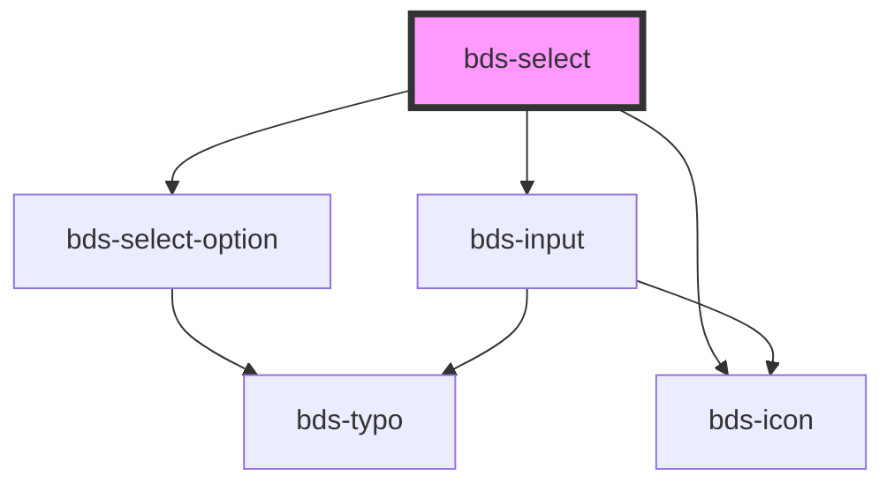

# bds-select

<!-- Auto Generated Below -->

## Properties

| Property  | Attribute | Description | Type       | Default |
| --------- | --------- | ----------- | ---------- | ------- |
| `options` | --        |             | `Option[]` | `[]`    |

## Dependencies

### Depends on

- [bds-select-option](../select-option)
- [bds-input](../input)
- [bds-icon](../icon)

### Graph

----------------------------------------------

*Built with [StencilJS](https://stenciljs.com/)*
