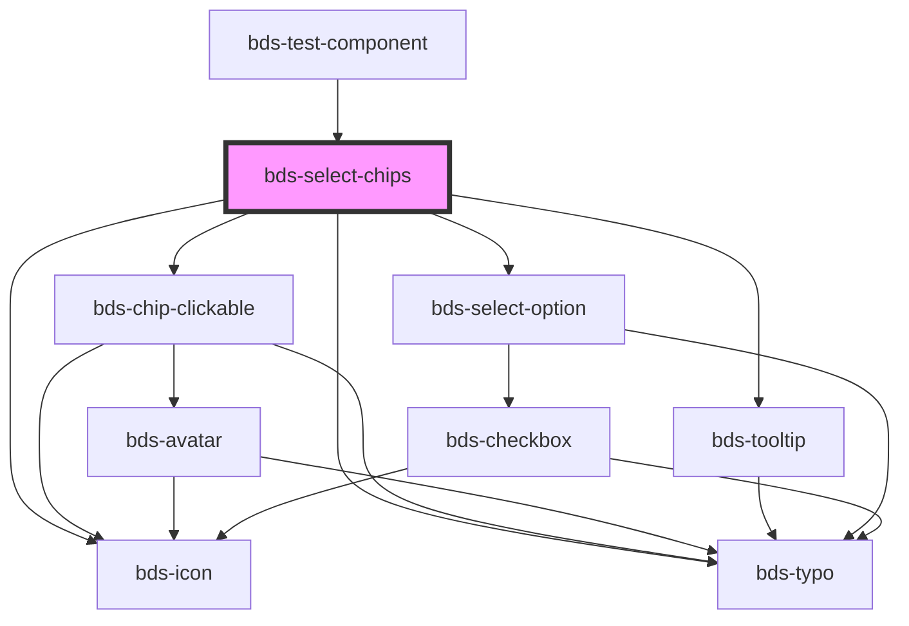

# bds-select-chips

<!-- Auto Generated Below -->

## Properties

| Property          | Attribute           | Description                                                                                                                                                                                                                                                                                   | Type                          | Default              |
| ----------------- | ------------------- | --------------------------------------------------------------------------------------------------------------------------------------------------------------------------------------------------------------------------------------------------------------------------------------------- | ----------------------------- | -------------------- |
| `canAddNew`       | `can-add-new`       | Specify if is possible to create a new tag that is not on the options.                                                                                                                                                                                                                        | `boolean`                     | `true`               |
| `chips`           | `chips`             | The chips on the component Should be passed this way: chips='["chip1", "chip2"]'                                                                                                                                                                                                              | `string \| string[]`          | `[]`                 |
| `danger`          | `danger`            | Add state danger on input, use for use feedback.                                                                                                                                                                                                                                              | `boolean`                     | `false`              |
| `dataTest`        | `data-test`         | Data test is the prop to specifically test the component action object.                                                                                                                                                                                                                       | `string`                      | `null`               |
| `delimiters`      | --                  | The delimiter is used to add multiple chips in the same string.                                                                                                                                                                                                                               | `RegExp`                      | `/,\|;/`             |
| `disableSubmit`   | `disable-submit`    | If `true`, the user cannot modify the value.                                                                                                                                                                                                                                                  | `boolean`                     | `false`              |
| `disabled`        | `disabled`          | Disabled input.                                                                                                                                                                                                                                                                               | `boolean`                     | `false`              |
| `duplicated`      | `duplicated`        | Do not accept duplicate chip elements.                                                                                                                                                                                                                                                        | `boolean`                     | `false`              |
| `errorMessage`    | `error-message`     | Indicated to pass an feedback to user.                                                                                                                                                                                                                                                        | `string`                      | `''`                 |
| `helperMessage`   | `helper-message`    | Indicated to pass a help the user in complex filling.                                                                                                                                                                                                                                         | `string`                      | `''`                 |
| `icon`            | `icon`              | used for add icon in input left. Uses the bds-icon component.                                                                                                                                                                                                                                 | `string`                      | `''`                 |
| `inputName`       | `input-name`        | Prop to insert the name of the input                                                                                                                                                                                                                                                          | `string`                      | `''`                 |
| `label`           | `label`             | label in input, with he the input size increases.                                                                                                                                                                                                                                             | `string`                      | `''`                 |
| `maxlength`       | `maxlength`         | Set maximum length value for the chip content                                                                                                                                                                                                                                                 | `number`                      | `undefined`          |
| `newPrefix`       | `new-prefix`        | Used for add prefix on new option select.                                                                                                                                                                                                                                                     | `string`                      | `''`                 |
| `notFoundMessage` | `not-found-message` | Specify if is possible to create a new tag that is not on the options.                                                                                                                                                                                                                        | `string`                      | `'No results found'` |
| `options`         | `options`           | The options of the select Should be passed this way: options='[{"value": "Cat", "label": "Meow"}, {"value": "Dog", "label": "Woof"}]' Options can also be passed as child by using bds-select-option component, but passing as a child you may have some compatibility problems with Angular. | `Option[] \| string`          | `undefined`          |
| `optionsPosition` | `options-position`  | Set the placement of the options menu. Can be 'bottom' or 'top'.                                                                                                                                                                                                                              | `"auto" \| "bottom" \| "top"` | `'auto'`             |
| `placeholder`     | `placeholder`       | A tip for the user who can enter no controls.                                                                                                                                                                                                                                                 | `string`                      | `''`                 |
| `success`         | `success`           | Add state success on input, use for use feedback.                                                                                                                                                                                                                                             | `boolean`                     | `false`              |
| `successMessage`  | `success-message`   | Indicated to pass an feeback to user.                                                                                                                                                                                                                                                         | `string`                      | `''`                 |
| `type`            | `type`              | Defining the type is important so that it is possible to carry out validations. Can be one of: 'text' and 'email;                                                                                                                                                                             | `"email" \| "text"`           | `'text'`             |
| `value`           | `value`             | the value of the select.                                                                                                                                                                                                                                                                      | `string`                      | `''`                 |

## Events

| Event                 | Description                              | Type                             |
| --------------------- | ---------------------------------------- | -------------------------------- |
| `bdsBlur`             | Emitted when the select loses focus.     | `CustomEvent<void>`              |
| `bdsCancel`           | Emitted when the selection is cancelled. | `CustomEvent<void>`              |
| `bdsChange`           | Emitted when the value has changed.      | `CustomEvent<SelectChangeEvent>` |
| `bdsChangeChips`      | Emitted when the chip has added.         | `CustomEvent<any>`               |
| `bdsFocus`            | Emitted when the select loses focus.     | `CustomEvent<void>`              |
| `bdsSelectChipsInput` | Emitted when the chip has added.         | `CustomEvent<any>`               |
| `bdsSubmit`           | Emitted when the chip has added.         | `CustomEvent<any>`               |

## Methods

### `add(value: string) => Promise<void>`

#### Returns

Type: `Promise<void>`

### `clear() => Promise<void>`

Clear all chips

#### Returns

Type: `Promise<void>`

### `getChips() => Promise<string[]>`

Return the chips

#### Returns

Type: `Promise<string[]>`

### `isValid() => Promise<boolean>`

Return the validity of the input chips.

#### Returns

Type: `Promise<boolean>`

### `removeFocus() => Promise<void>`

#### Returns

Type: `Promise<void>`

### `setFocus() => Promise<void>`

#### Returns

Type: `Promise<void>`

## Shadow Parts

| Part               | Description |
| ------------------ | ----------- |
| `"input__message"` |             |

## Dependencies

### Used by

 - [bds-test-component](../../test-component)

### Depends on

- [bds-chip-clickable](../../chip-clickable)
- [bds-tooltip](../../tooltip)
- [bds-icon](../../icon)
- [bds-typo](../../typo)
- [bds-select-option](../../select-option)

### Graph

----------------------------------------------

*Built with [StencilJS](https://stenciljs.com/)*
