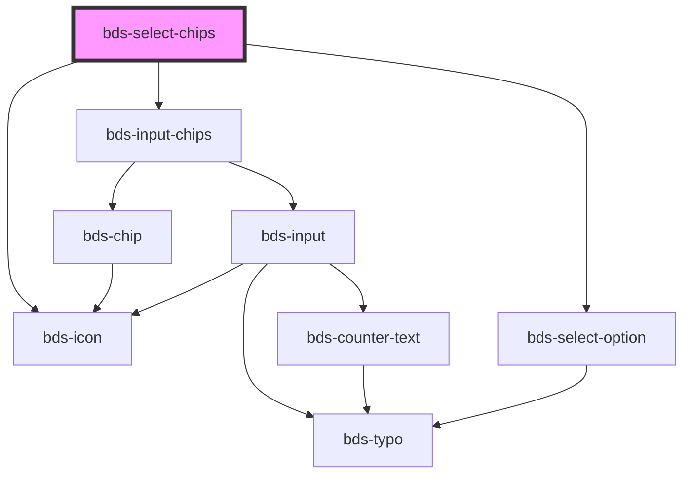

# bds-select-chips

<!-- Auto Generated Below -->

## Properties

| Property          | Attribute           | Description                                                                                                                                                                                                                                                                                   | Type                 | Default              |
| ----------------- | ------------------- | --------------------------------------------------------------------------------------------------------------------------------------------------------------------------------------------------------------------------------------------------------------------------------------------- | -------------------- | -------------------- |
| `canAddNew`       | `can-add-new`       | Specify if is possible to create a new tag that is not on the options.                                                                                                                                                                                                                        | `boolean`            | `true`               |
| `chips`           | `chips`             | The chips on the component Should be passed this way: chips='["chip1", "chip2"]'                                                                                                                                                                                                              | `string \| string[]` | `[]`                 |
| `danger`          | `danger`            | Add state danger on input, use for use feedback.                                                                                                                                                                                                                                              | `boolean`            | `false`              |
| `disabled`        | `disabled`          | Disabled input.                                                                                                                                                                                                                                                                               | `boolean`            | `false`              |
| `duplicated`      | `duplicated`        | Do not accept duplicate chip elements.                                                                                                                                                                                                                                                        | `boolean`            | `false`              |
| `errorMessage`    | `error-message`     | Indicated to pass an feedback to user.                                                                                                                                                                                                                                                        | `string`             | `''`                 |
| `icon`            | `icon`              | used for add icon in input left. Uses the bds-icon component.                                                                                                                                                                                                                                 | `string`             | `''`                 |
| `label`           | `label`             | label in input, with he the input size increases.                                                                                                                                                                                                                                             | `string`             | `''`                 |
| `maxlength`       | `maxlength`         | Set maximum length value for the chip content                                                                                                                                                                                                                                                 | `number`             | `undefined`          |
| `newPrefix`       | `new-prefix`        | Used for add prefix on new option select.                                                                                                                                                                                                                                                     | `string`             | `''`                 |
| `notFoundMessage` | `not-found-message` | Specify if is possible to create a new tag that is not on the options.                                                                                                                                                                                                                        | `string`             | `'No results found'` |
| `options`         | `options`           | The options of the select Should be passed this way: options='[{"value": "Cat", "label": "Meow"}, {"value": "Dog", "label": "Woof"}]' Options can also be passed as child by using bds-select-option component, but passing as a child you may have some compatibility problems with Angular. | `Option[] \| string` | `[]`                 |
| `value`           | `value`             | the value of the select.                                                                                                                                                                                                                                                                      | `string`             | `''`                 |

## Events

| Event       | Description                              | Type                                   |
| ----------- | ---------------------------------------- | -------------------------------------- |
| `bdsBlur`   | Emitted when the select loses focus.     | `CustomEvent<void>`                    |
| `bdsCancel` | Emitted when the selection is cancelled. | `CustomEvent<void>`                    |
| `bdsChange` | Emitted when the value has changed.      | `CustomEvent<SelectChangeEventDetail>` |
| `bdsFocus`  | Emitted when the select loses focus.     | `CustomEvent<void>`                    |

## Methods

### `getChips() => Promise<string[]>`

Return the internal chips.

#### Returns

Type: `Promise<string[]>`

### `isValid() => Promise<boolean>`

Return the validity of the input chips.

#### Returns

Type: `Promise<boolean>`

## Dependencies

### Depends on

- [bds-input-chips](../../input-chips)
- [bds-icon](../../icon)
- [bds-select-option](../../select-option)

### Graph

----------------------------------------------

*Built with [StencilJS](https://stenciljs.com/)*
