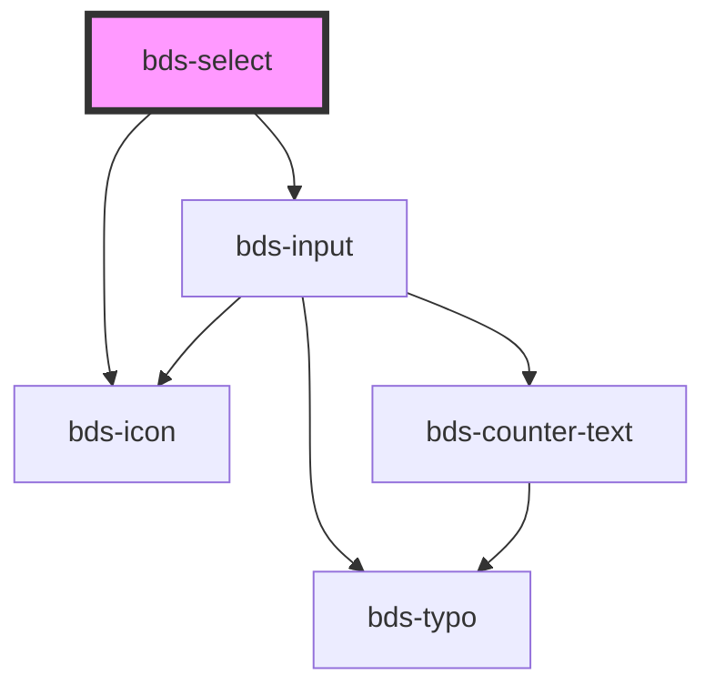

# bds-select

<!-- Auto Generated Below -->

## Properties

| Property      | Attribute     | Description                                                   | Type       | Default     |
| ------------- | ------------- | ------------------------------------------------------------- | ---------- | ----------- |
| `danger`      | `danger`      | Add state danger on input, use for use feedback.              | `boolean`  | `false`     |
| `disabled`    | `disabled`    | Disabled input.                                               | `boolean`  | `false`     |
| `icon`        | `icon`        | used for add icon in input left. Uses the bds-icon component. | `string`   | `''`        |
| `label`       | `label`       | label in input, with he the input size increases.             | `string`   | `''`        |
| `options`     | --            |                                                               | `Option[]` | `[]`        |
| `placeholder` | `placeholder` | Placeholder for native input element.                         | `string`   | `''`        |
| `value`       | `value`       | the value of the select.                                      | `any`      | `undefined` |

## Events

| Event       | Description                              | Type                                   |
| ----------- | ---------------------------------------- | -------------------------------------- |
| `bdsBlur`   | Emitted when the select loses focus.     | `CustomEvent<void>`                    |
| `bdsCancel` | Emitted when the selection is cancelled. | `CustomEvent<void>`                    |
| `bdsChange` | Emitted when the value has changed.      | `CustomEvent<SelectChangeEventDetail>` |
| `bdsFocus`  | Emitted when the select loses focus.     | `CustomEvent<void>`                    |

## Dependencies

### Depends on

- [bds-input](../../input)
- [bds-icon](../../icon)

### Graph

----------------------------------------------

*Built with [StencilJS](https://stenciljs.com/)*
