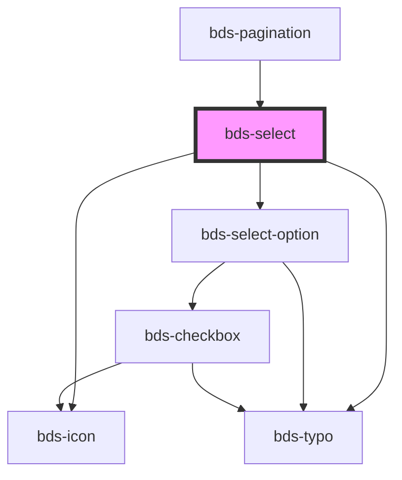

# bds-select

<!-- Auto Generated Below -->

## Properties

| Property          | Attribute          | Description                                                                                                                                                                                                                                                                                   | Type                          | Default     |
| ----------------- | ------------------ | --------------------------------------------------------------------------------------------------------------------------------------------------------------------------------------------------------------------------------------------------------------------------------------------- | ----------------------------- | ----------- |
| `danger`          | `danger`           | Add state danger on input, use for use feedback.                                                                                                                                                                                                                                              | `boolean`                     | `false`     |
| `dataTest`        | `data-test`        | Data test is the prop to specifically test the component action object.                                                                                                                                                                                                                       | `string`                      | `null`      |
| `disabled`        | `disabled`         | Disabled input.                                                                                                                                                                                                                                                                               | `boolean`                     | `false`     |
| `errorMessage`    | `error-message`    | Indicated to pass an feeback to user.                                                                                                                                                                                                                                                         | `string`                      | `''`        |
| `helperMessage`   | `helper-message`   | Indicated to pass a help the user in complex filling.                                                                                                                                                                                                                                         | `string`                      | `''`        |
| `icon`            | `icon`             | used for add icon in input left. Uses the bds-icon component.                                                                                                                                                                                                                                 | `string`                      | `''`        |
| `label`           | `label`            | label in input, with he the input size increases.                                                                                                                                                                                                                                             | `string`                      | `''`        |
| `options`         | `options`          | The options of the select Should be passed this way: options='[{"value": "Cat", "label": "Meow"}, {"value": "Dog", "label": "Woof"}]' Options can also be passed as child by using bds-select-option component, but passing as a child you may have some compatibility problems with Angular. | `Option[] \| string`          | `undefined` |
| `optionsPosition` | `options-position` | Set the placement of the options menu. Can be 'bottom' or 'top'.                                                                                                                                                                                                                              | `"auto" \| "bottom" \| "top"` | `'auto'`    |
| `placeholder`     | `placeholder`      | Placeholder for native input element.                                                                                                                                                                                                                                                         | `string`                      | `''`        |
| `success`         | `success`          | Add state success on input, use for use feedback.                                                                                                                                                                                                                                             | `boolean`                     | `false`     |
| `successMessage`  | `success-message`  | Indicated to pass an feeback to user.                                                                                                                                                                                                                                                         | `string`                      | `''`        |
| `value`           | `value`            | the value of the select.                                                                                                                                                                                                                                                                      | `any`                         | `undefined` |

## Events

| Event       | Description                              | Type                                   |
| ----------- | ---------------------------------------- | -------------------------------------- |
| `bdsBlur`   | Emitted when the select loses focus.     | `CustomEvent<void>`                    |
| `bdsCancel` | Emitted when the selection is cancelled. | `CustomEvent<void>`                    |
| `bdsChange` | Emitted when the value has changed.      | `CustomEvent<SelectChangeEventDetail>` |
| `bdsFocus`  | Emitted when the select loses focus.     | `CustomEvent<void>`                    |

## Shadow Parts

| Part                | Description |
| ------------------- | ----------- |
| `"input-container"` |             |
| `"input__message"`  |             |

## Dependencies

### Used by

 - [bds-pagination](../../pagination)

### Depends on

- [bds-icon](../../icon)
- [bds-typo](../../typo)
- [bds-select-option](../../select-option)

### Graph

----------------------------------------------

*Built with [StencilJS](https://stenciljs.com/)*
