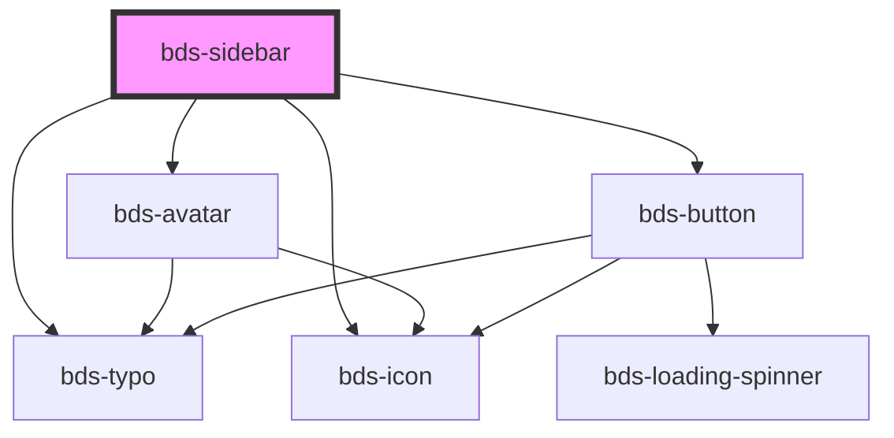

# bds-sidebar

<!-- Auto Generated Below -->

## Properties

| Property             | Attribute              | Description                                                                         | Type                | Default  |
| -------------------- | ---------------------- | ----------------------------------------------------------------------------------- | ------------------- | -------- |
| `footerButtonApply`  | `footer-button-apply`  | footer Button Apply. Used to add title in button apply.                             | `string`            | `null`   |
| `footerButtonCancel` | `footer-button-cancel` | footer Button Cancel. Used to add title in button cancel.                           | `string`            | `null`   |
| `headerAvatarName`   | `header-avatar-name`   | header Avatar Name. Used to add avatar in header sidebar.                           | `string`            | `null`   |
| `headerAvatarThumb`  | `header-avatar-thumb`  | header Avatar Thumb. Used to add avatar in header sidebar.                          | `string`            | `null`   |
| `headerIcon`         | `header-icon`          | header Icon. Used to add icon in header sidebar.                                    | `string`            | `null`   |
| `headerTitle`        | `header-title`         | header Title. Used to add title in header sidebar.                                  | `string`            | `null`   |
| `isOpen`             | `is-open`              | isOpen. Used to open sidebar.                                                       | `boolean`           | `false`  |
| `sidebarPosition`    | `sidebar-position`     | sidebar position. Used to position the sidebar. Either on the left or on the right. | `"left" \| "right"` | `'left'` |

## Events

| Event                  | Description                                                | Type               |
| ---------------------- | ---------------------------------------------------------- | ------------------ |
| `bdsClickApplyButtom`  | bdsClickApplyButtom. Event to return click apply buttom.   | `CustomEvent<any>` |
| `bdsClickCancelButtom` | bdsClickCancelButtom. Event to return click cancel buttom. | `CustomEvent<any>` |

## Methods

### `toggle() => Promise<void>`

#### Returns

Type: `Promise<void>`

## Dependencies

### Depends on

- [bds-avatar](../avatar)
- [bds-icon](../icon)
- [bds-typo](../typo)
- [bds-button](../button)

### Graph

----------------------------------------------

*Built with [StencilJS](https://stenciljs.com/)*
