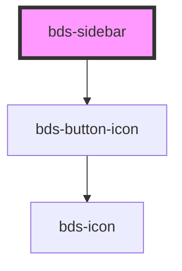

# bds-sidebar

<!-- Auto Generated Below -->

## Properties

| Property          | Attribute          | Description                                                                         | Type                                                       | Default       |
| ----------------- | ------------------ | ----------------------------------------------------------------------------------- | ---------------------------------------------------------- | ------------- |
| `background`      | `background`       | Width, number to define sidebar width.                                              | `"surface-1" \| "surface-2" \| "surface-3" \| "surface-4"` | `'surface-2'` |
| `isOpen`          | `is-open`          | ; isOpen. Used to open sidebar.                                                     | `boolean`                                                  | `false`       |
| `margin`          | `margin`           | If true, a lateral margin will apear in the content.                                | `boolean`                                                  | `true`        |
| `sidebarPosition` | `sidebar-position` | sidebar position. Used to position the sidebar. Either on the left or on the right. | `"left" \| "right"`                                        | `'left'`      |
| `type`            | `type`             | sidebar type. Used to define how open.                                              | `"fixed" \| "over"`                                        | `'over'`      |
| `width`           | `width`            | Width, number to define sidebar width.                                              | `number`                                                   | `undefined`   |

## Methods

### `toggle() => Promise<void>`

#### Returns

Type: `Promise<void>`

## Dependencies

### Depends on

- [bds-button-icon](../icon-button)

### Graph

----------------------------------------------

*Built with [StencilJS](https://stenciljs.com/)*
