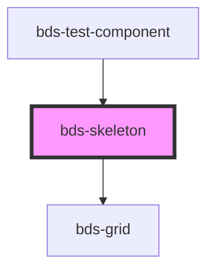

# bds-skeleton

<!-- Auto Generated Below -->

## Properties

| Property | Attribute | Description | Type                   | Default    |
| -------- | --------- | ----------- | ---------------------- | ---------- |
| `height` | `height`  |             | `string`               | `'50px'`   |
| `shape`  | `shape`   |             | `"circle" \| "square"` | `'square'` |
| `width`  | `width`   |             | `string`               | `'100%'`   |

## Dependencies

### Used by

 - [bds-test-component](../test-component)

### Depends on

- [bds-grid](../grid)

### Graph

----------------------------------------------

*Built with [StencilJS](https://stenciljs.com/)*
