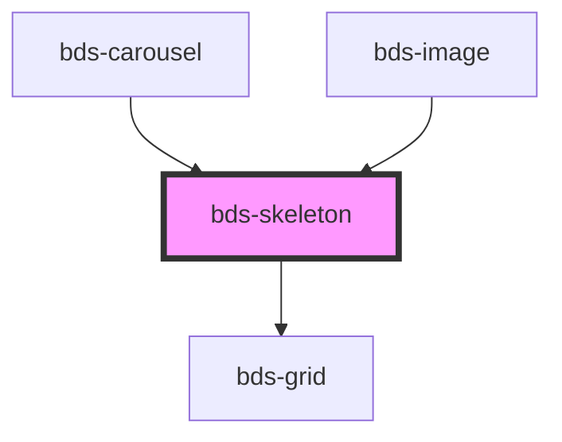

# bds-skeleton

<!-- Auto Generated Below -->

## Properties

| Property   | Attribute   | Description                                                             | Type                   | Default    |
| ---------- | ----------- | ----------------------------------------------------------------------- | ---------------------- | ---------- |
| `dataTest` | `data-test` | Data test is the prop to specifically test the component action object. | `string`               | `null`     |
| `height`   | `height`    |                                                                         | `string`               | `'50px'`   |
| `shape`    | `shape`     |                                                                         | `"circle" \| "square"` | `'square'` |
| `width`    | `width`     |                                                                         | `string`               | `'100%'`   |

## Dependencies

### Used by

 - [bds-carousel](../carousel)
 - [bds-image](../image)

### Depends on

- [bds-grid](../grid)

### Graph

----------------------------------------------

*Built with [StencilJS](https://stenciljs.com/)*
