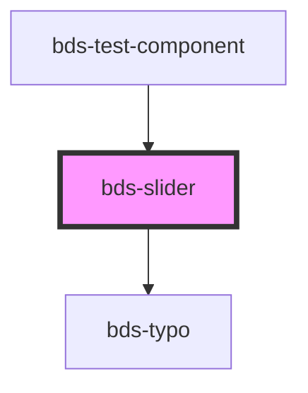

# bds-slider

<!-- Auto Generated Below -->

## Properties

| Property      | Attribute  | Description                                          | Type                                           | Default                                                       |
| ------------- | ---------- | ---------------------------------------------------- | ---------------------------------------------- | ------------------------------------------------------------- |
| `dataMarkers` | --         | Data Markers, prop to select ype of markers.         | `StepOption[]`                                 | `undefined`                                                   |
| `markers`     | `markers`  | Markers, prop to select ype of markers.              | `"default" \| "markers" \| "without-subtitle"` | `'default'`                                                   |
| `max`         | `max`      | Max, property to set the maximum value of the range. | `number`                                       | `undefined`                                                   |
| `min`         | `min`      | Min, property to set the minimum value of the range. | `number`                                       | `undefined`                                                   |
| `progress`    | `progress` | Progress, prop to select ype of Progress.            | `"default" \| "no-linear"`                     | `'default'`                                                   |
| `step`        | `step`     | Step, property to insert steps into the input range. | `number`                                       | `undefined`                                                   |
| `type`        | `type`     | Type, prop to select type.                           | `"default" \| "range"`                         | `'default'`                                                   |
| `value`       | `value`    | Value, prop to define value of input.                | `number \| number[]`                           | `this.type === 'range' ? undefined : this.min ? this.min : 0` |

## Events

| Event       | Description                                     | Type               |
| ----------- | ----------------------------------------------- | ------------------ |
| `bdsChange` | bdsChange. Event to return selected date value. | `CustomEvent<any>` |

## Dependencies

### Used by

 - [bds-test-component](../test-component)

### Depends on

- [bds-typo](../typo)

### Graph

----------------------------------------------

*Built with [StencilJS](https://stenciljs.com/)*
