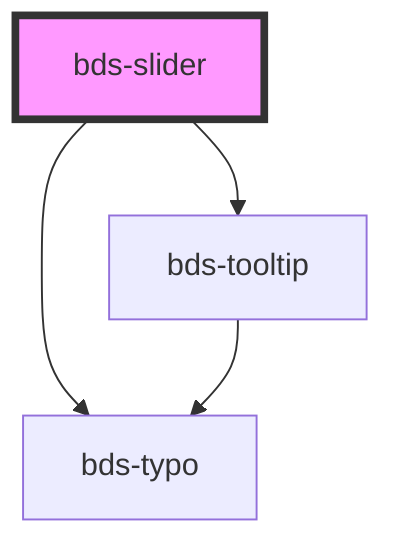

# bds-slider

<!-- Auto Generated Below -->

## Properties

| Property      | Attribute      | Description                                          | Type                     | Default                   |
| ------------- | -------------- | ---------------------------------------------------- | ------------------------ | ------------------------- |
| `dataMarkers` | `data-markers` | Data Markers, prop to select ype of markers.         | `StepOption[] \| string` | `undefined`               |
| `label`       | `label`        | Label, Prop to enable Label.                         | `boolean`                | `false`                   |
| `markers`     | `markers`      | Markers, Prop to enable markers.                     | `boolean`                | `false`                   |
| `max`         | `max`          | Max, property to set the maximum value of the range. | `number`                 | `undefined`               |
| `min`         | `min`          | Min, property to set the minimum value of the range. | `number`                 | `undefined`               |
| `step`        | `step`         | Step, property to insert steps into the input range. | `number`                 | `undefined`               |
| `type`        | `type`         | Type, prop to select type of slider.                 | `"fill" \| "no-linear"`  | `'fill'`                  |
| `value`       | `value`        | Value, prop to define value of input.                | `number`                 | `this.min ? this.min : 0` |

## Events

| Event       | Description                                     | Type               |
| ----------- | ----------------------------------------------- | ------------------ |
| `bdsChange` | bdsChange. Event to return selected date value. | `CustomEvent<any>` |

## Dependencies

### Depends on

- [bds-tooltip](../tooltip)
- [bds-typo](../typo)

### Graph

----------------------------------------------

*Built with [StencilJS](https://stenciljs.com/)*
