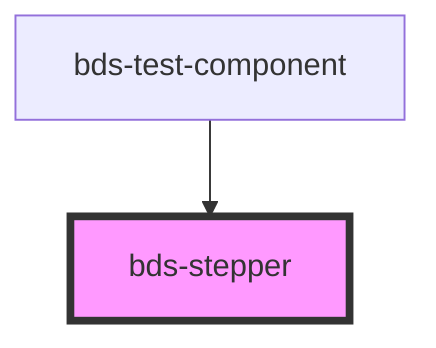

# bds-stepper

<!-- Auto Generated Below -->

## Methods

### `getActiveStep() => Promise<number>`

Returns the active step

#### Returns

Type: `Promise<number>`

HTMLBdsStepElement

### `resetActiveSteps() => Promise<void>`

Reset all active steps

#### Returns

Type: `Promise<void>`

void

### `resetCompletedSteps() => Promise<void>`

Reset all completed steps

#### Returns

Type: `Promise<void>`

void

### `setActiveStep(index: number) => Promise<void>`

Set the active step

#### Returns

Type: `Promise<void>`

void

### `setCompletedStep(index: number) => Promise<void>`

Set the completed step

#### Returns

Type: `Promise<void>`

void

## Dependencies

### Used by

 - [bds-test-component](../test-component)

### Graph

----------------------------------------------

*Built with [StencilJS](https://stenciljs.com/)*
