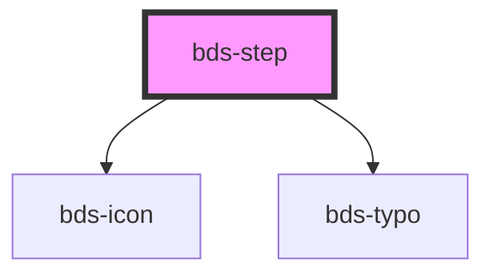

# bds-step

<!-- Auto Generated Below -->

## Properties

| Property    | Attribute   | Description                                        | Type      | Default |
| ----------- | ----------- | -------------------------------------------------- | --------- | ------- |
| `active`    | `active`    | Used to set the step as active                     | `boolean` | `false` |
| `completed` | `completed` | Used to complete the step                          | `boolean` | `false` |
| `disabled`  | `disabled`  | Used to set the step as disabled                   | `boolean` | `true`  |
| `index`     | `index`     | Used to set the index of the steps                 | `number`  | `0`     |
| `last`      | `last`      | Used to define the last step component on the list | `boolean` | `false` |

## Dependencies

### Depends on

- [bds-icon](../../icon)
- [bds-typo](../../typo)

### Graph

----------------------------------------------

*Built with [StencilJS](https://stenciljs.com/)*
