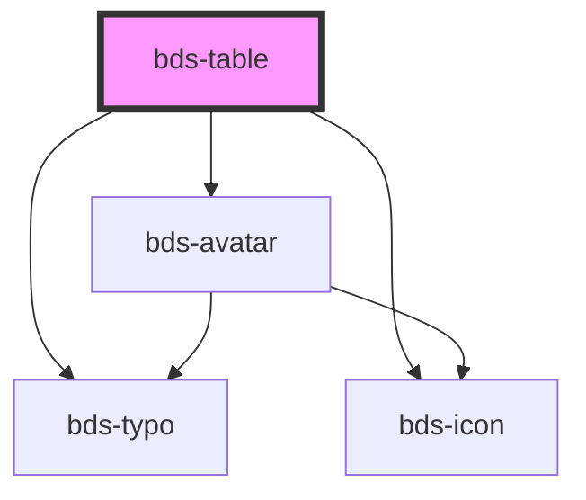

# bds-table

<!-- Auto Generated Below -->

## Properties

| Property  | Attribute | Description | Type      | Default     |
| --------- | --------- | ----------- | --------- | ----------- |
| `avatar`  | `avatar`  |             | `boolean` | `false`     |
| `check`   | `check`   |             | `boolean` | `true`      |
| `column`  | `column`  |             | `any`     | `undefined` |
| `options` | `options` |             | `any`     | `undefined` |

## Dependencies

### Depends on

- [bds-typo](../typo)
- [bds-icon](../icon)
- [bds-avatar](../avatar)

### Graph

----------------------------------------------

*Built with [StencilJS](https://stenciljs.com/)*
