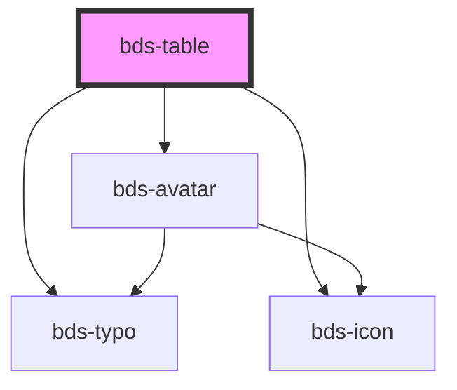

# bds-table

<!-- Auto Generated Below -->

## Properties

| Property  | Attribute | Description                                                   | Type      | Default     |
| --------- | --------- | ------------------------------------------------------------- | --------- | ----------- |
| `avatar`  | `avatar`  | Prop to activate the possibility of use avatar in any column. | `boolean` | `false`     |
| `column`  | `column`  | Prop to recive the header and configuration of table.         | `string`  | `undefined` |
| `options` | `options` | Prop to recive the content of the table.                      | `string`  | `undefined` |
| `sorting` | `sorting` | Prop to activate the sorting.                                 | `boolean` | `false`     |

## Dependencies

### Depends on

- [bds-typo](../typo)
- [bds-icon](../icon)
- [bds-avatar](../avatar)

### Graph

----------------------------------------------

*Built with [StencilJS](https://stenciljs.com/)*
