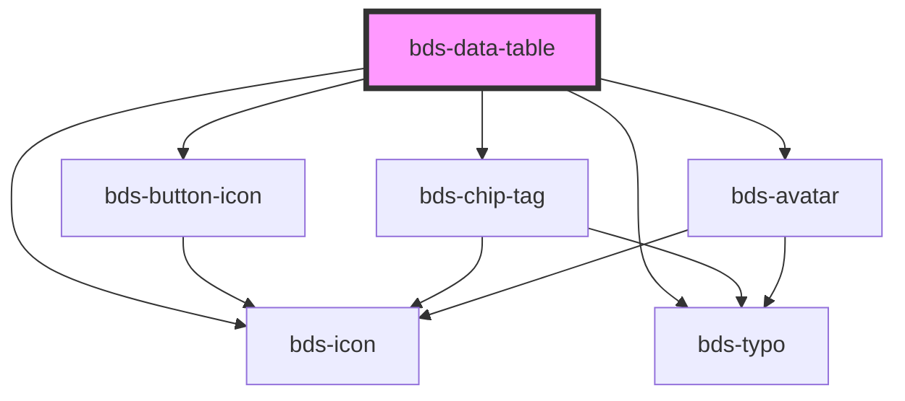

# bds-table

<!-- Auto Generated Below -->

## Properties

| Property     | Attribute     | Description                                                   | Type      | Default     |
| ------------ | ------------- | ------------------------------------------------------------- | --------- | ----------- |
| `actionArea` | `action-area` | Prop to activate the possibility of use chip in any column.   | `boolean` | `undefined` |
| `avatar`     | `avatar`      | Prop to activate the possibility of use avatar in any column. | `boolean` | `false`     |
| `chips`      | `chips`       | Prop to activate the possibility of use chip in any column.   | `boolean` | `false`     |
| `column`     | `column`      | Prop to recive the header and configuration of table.         | `string`  | `undefined` |
| `options`    | `options`     | Prop to recive the content of the table.                      | `string`  | `undefined` |
| `sorting`    | `sorting`     | Prop to activate the sorting.                                 | `boolean` | `false`     |

## Events

| Event            | Description | Type               |
| ---------------- | ----------- | ------------------ |
| `bdsTableChange` |             | `CustomEvent<any>` |
| `bdsTableClick`  |             | `CustomEvent<any>` |
| `bdsTableDelete` |             | `CustomEvent<any>` |

## Methods

### `deleteItem(index: number) => Promise<void>`

#### Parameters

| Name    | Type     | Description |
| ------- | -------- | ----------- |
| `index` | `number` |             |

#### Returns

Type: `Promise<void>`

## Dependencies

### Depends on

- [bds-icon](../icon)
- [bds-typo](../typo)
- [bds-button-icon](../icon-button)
- [bds-chip-tag](../chip-tag)
- [bds-avatar](../avatar)

### Graph

----------------------------------------------

*Built with [StencilJS](https://stenciljs.com/)*
