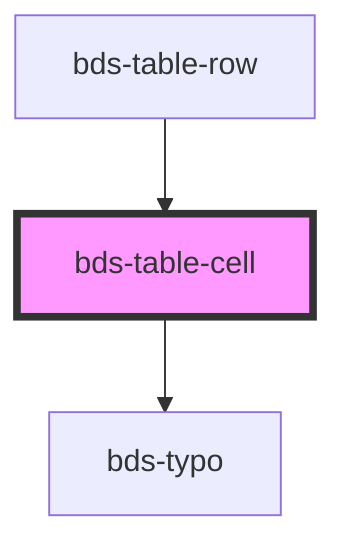

# bds-table-cell

<!-- Auto Generated Below -->

## Properties

| Property   | Attribute  | Description | Type      | Default  |
| ---------- | ---------- | ----------- | --------- | -------- |
| `sortable` | `sortable` |             | `boolean` | `false`  |
| `type`     | `type`     |             | `string`  | `'text'` |

## Dependencies

### Used by

 - [bds-table-row](../table-row)

### Depends on

- [bds-typo](../../typo)

### Graph

----------------------------------------------

*Built with [StencilJS](https://stenciljs.com/)*
