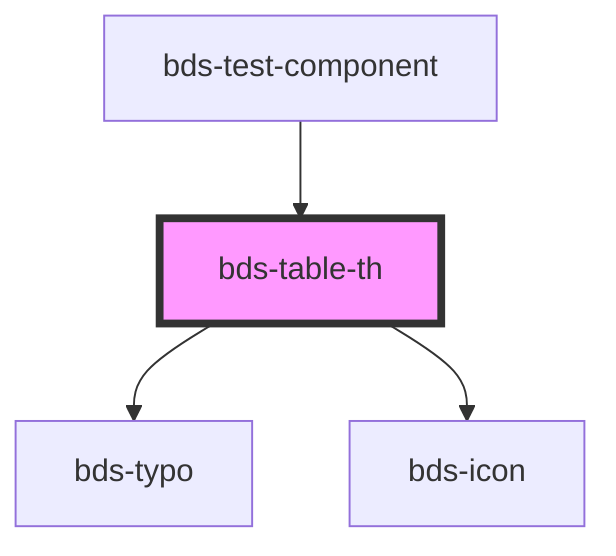

# bds-table-th

<!-- Auto Generated Below -->

## Properties

| Property   | Attribute  | Description | Type      | Default |
| ---------- | ---------- | ----------- | --------- | ------- |
| `arrow`    | `arrow`    |             | `string`  | `''`    |
| `sortable` | `sortable` |             | `boolean` | `false` |

## Dependencies

### Used by

 - [bds-test-component](../../test-component)

### Depends on

- [bds-typo](../../typo)
- [bds-icon](../../icon)

### Graph

----------------------------------------------

*Built with [StencilJS](https://stenciljs.com/)*
