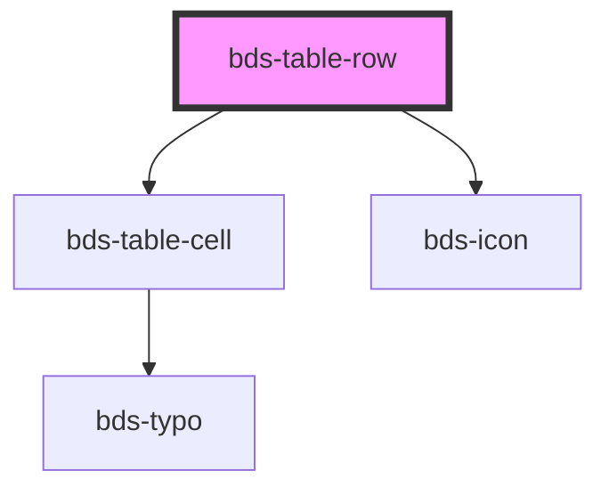

# bds-table-row

<!-- Auto Generated Below -->

## Properties

| Property       | Attribute       | Description                         | Type      | Default     |
| -------------- | --------------- | ----------------------------------- | --------- | ----------- |
| `bodyCollapse` | `body-collapse` |                                     | `string`  | `undefined` |
| `clickable`    | `clickable`     | Prop to make hover animation.       | `boolean` | `false`     |
| `dataTarget`   | `data-target`   |                                     | `string`  | `undefined` |
| `selected`     | `selected`      | Prop to highlight the row selected. | `boolean` | `false`     |

## Dependencies

### Depends on

- [bds-table-cell](../table-cell)
- [bds-icon](../../icon)

### Graph

----------------------------------------------

*Built with [StencilJS](https://stenciljs.com/)*
