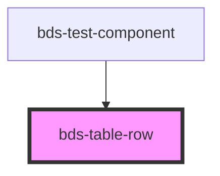

# bds-table-row

<!-- Auto Generated Below -->

## Properties

| Property       | Attribute       | Description                         | Type      | Default |
| -------------- | --------------- | ----------------------------------- | --------- | ------- |
| `bodyCollapse` | `body-collapse` |                                     | `boolean` | `false` |
| `clickable`    | `clickable`     | Prop to make hover animation.       | `boolean` | `false` |
| `collapse`     | `collapse`      |                                     | `boolean` | `false` |
| `selected`     | `selected`      | Prop to highlight the row selected. | `boolean` | `false` |

## Dependencies

### Used by

 - [bds-test-component](../../test-component)

### Graph

----------------------------------------------

*Built with [StencilJS](https://stenciljs.com/)*
