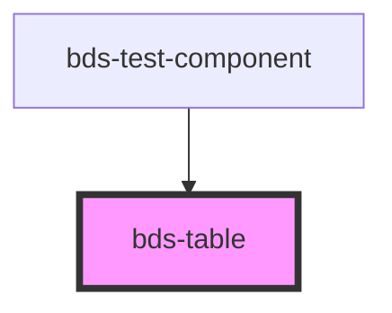

# bds-table-all

<!-- Auto Generated Below -->

## Properties

| Property     | Attribute     | Description                                                                                               | Type      | Default     |
| ------------ | ------------- | --------------------------------------------------------------------------------------------------------- | --------- | ----------- |
| `denseTable` | `dense-table` | Determines if the table has a higher content density, typically resulting in more compact rows and cells. | `boolean` | `undefined` |
| `scrollable` | `scrollable`  | Specifies whether the table is scrollable or not.                                                         | `boolean` | `undefined` |

## Dependencies

### Used by

 - [bds-test-component](../../test-component)

### Graph

----------------------------------------------

*Built with [StencilJS](https://stenciljs.com/)*
