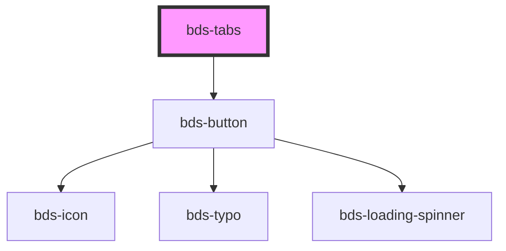

# bds-tabs

<!-- Auto Generated Below -->

## Properties

| Property   | Attribute  | Description | Type      | Default |
| ---------- | ---------- | ----------- | --------- | ------- |
| `overflow` | `overflow` |             | `boolean` | `false` |

## Events

| Event          | Description | Type               |
| -------------- | ----------- | ------------------ |
| `scrollButton` |             | `CustomEvent<any>` |

## Dependencies

### Depends on

- [bds-button](../button)

### Graph

----------------------------------------------

*Built with [StencilJS](https://stenciljs.com/)*
