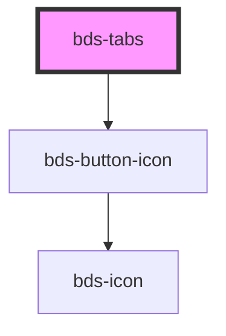

# bds-tabs

<!-- Auto Generated Below -->

## Properties

| Property | Attribute | Description | Type                            | Default    |
| -------- | --------- | ----------- | ------------------------------- | ---------- |
| `align`  | `align`   |             | `"center" \| "left" \| "right"` | `'center'` |

## Events

| Event               | Description | Type                    |
| ------------------- | ----------- | ----------------------- |
| `scrollButtonClick` |             | `CustomEvent<Overflow>` |

## Dependencies

### Depends on

- [bds-button-icon](../icon-button)

### Graph

----------------------------------------------

*Built with [StencilJS](https://stenciljs.com/)*
