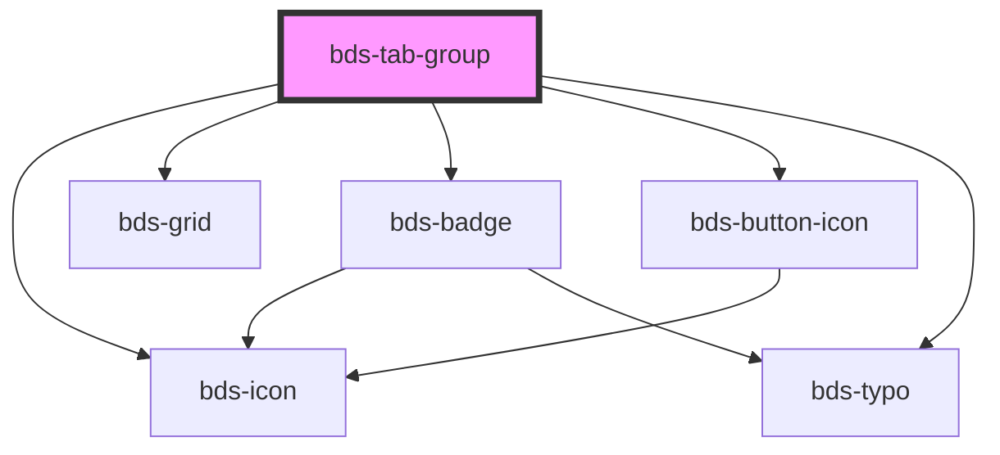

# bds-tab-group

<!-- Auto Generated Below -->

## Properties

| Property            | Attribute            | Description                                                                                                           | Type                            | Default    |
| ------------------- | -------------------- | --------------------------------------------------------------------------------------------------------------------- | ------------------------------- | ---------- |
| `align`             | `align`              |                                                                                                                       | `"center" \| "left" \| "right"` | `'center'` |
| `bodyStyled`        | `body-styled`        | Enable independent styling for body area                                                                              | `boolean`                       | `false`    |
| `contentScrollable` | `content-scrollable` |                                                                                                                       | `boolean`                       | `true`     |
| `dtButtonNext`      | `dt-button-next`     | Data test is the prop to specifically test the component action object. dtButtonNext is the data-test to button next. | `string`                        | `null`     |
| `dtButtonPrev`      | `dt-button-prev`     | Data test is the prop to specifically test the component action object. dtButtonPrev is the data-test to button prev. | `string`                        | `null`     |
| `navigationStyled`  | `navigation-styled`  | Enable independent styling for navigation area                                                                        | `boolean`                       | `false`    |

## Events

| Event            | Description                                                        | Type               |
| ---------------- | ------------------------------------------------------------------ | ------------------ |
| `bdsTabChange`   | bdsTabChange. Event to return value when Tabs is change.           | `CustomEvent<any>` |
| `bdsTabDisabled` | bdsTabDisabled. Event to return value when Tabs disable is change. | `CustomEvent<any>` |

## Dependencies

### Depends on

- [bds-icon](../icon)
- [bds-grid](../grid)
- [bds-badge](../badge)
- [bds-button-icon](../icon-button)
- [bds-typo](../typo)

### Graph

----------------------------------------------

*Built with [StencilJS](https://stenciljs.com/)*
