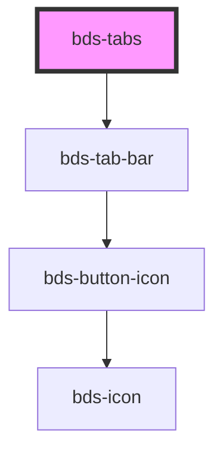

# bds-tabs

<!-- Auto Generated Below -->

## Properties

| Property       | Attribute       | Description | Type      | Default |
| -------------- | --------------- | ----------- | --------- | ------- |
| `overflowLeft` | `overflow-left` |             | `boolean` | `false` |

## Dependencies

### Depends on

- [bds-tab-bar](tab-bar)

### Graph

----------------------------------------------

*Built with [StencilJS](https://stenciljs.com/)*
