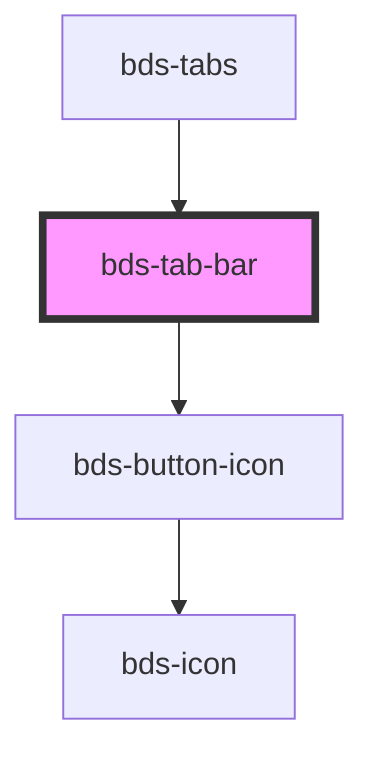

# tab-bar

<!-- Auto Generated Below -->

## Events

| Event               | Description | Type                                                         |
| ------------------- | ----------- | ------------------------------------------------------------ |
| `scrollButtonClick` |             | `CustomEvent<ScrollDirection.LEFT \| ScrollDirection.RIGHT>` |

## Dependencies

### Used by

 - [bds-tabs](..)

### Depends on

- [bds-button-icon](../../icon-button)

### Graph

----------------------------------------------

*Built with [StencilJS](https://stenciljs.com/)*
